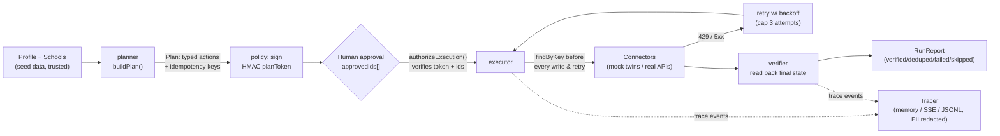

# TransferPilot — System & Reliability Brief

## 1. What it does

TransferPilot is a multi-app AI agent that turns a college transfer applicant's profile plus a list of target schools into verified action across their own apps: a per-school gap analysis, an essay critique written into a Google Doc, a Notion deadline tracker, Google Calendar reminders, and drafted (never sent) outreach emails in Gmail — plus read-only GitHub/Hugging Face/Obsidian portfolio evidence, all gated behind human approval. It is a workflow agent, not a chatbot: code drives the plan, and the LLM only fills schema-checked blanks (gap phrasing, critique text, email wording).

**Who it helps and why it's needed** — requirements, deadlines, and essay coaching for transfer applicants are scattered across separate tools (Transferology/ASSIST for course equivalency, CollegeVine-style chat for essays, Notion/Calendar/Gmail managed by hand); nothing turns "my profile + these schools" into checked results inside the student's own apps:

| Pain | Evidence | Source |
|---|---|---|
| Credit loss on transfer | GAO-17-574: transfers lost **~43%** of credits on average (2004–2009 cohort); CC-to-CC lost 69% | [gao.gov/products/gao-17-574](https://www.gao.gov/products/gao-17-574) |
| Prereq / major-prep mismatch | Texas 2025 Transfer Report: **54.3%** of universities cite students advised into courses that don't apply to the bachelor's as the #1 barrier; 45.7% cite inaccurate CC advising | [reportcenter.highered.texas.gov/reports/transfer-report-2025](https://reportcenter.highered.texas.gov/reports/transfer-report-2025/) |
| GPA expectations differ by program, not just school | Cornell A&S Economics publishes no minimum GPA but a **3.5** competitive GPA, while Cornell ILR admits typically have 3.4+; both require one instructor recommendation | Per-field sources in `web/src/lib/core/data/schools.json` (e.g. [ILR Transfer Guidelines PDF](https://archive.ilr.cornell.edu/sites/default/files-d8/2025-10/transfer-guidelines-fa-26-final.pdf) for ILR) |

## 2. Architecture

Workflow-first: the LLM never chooses tools or reads untrusted content before the plan is fixed. This structurally contains prompt injection — an instruction hidden in a doc or email cannot add a write action, because the plan (and the human approval over it) exists before that content is read.

<!-- TODO(phase 4): planner, policy (HMAC sign/verify, approvedIds authorization), executor (retry/backoff), and verifier (read-back) are designed in .planning/phases/04-sprint-pipeline-on-mocks/04-01-PLAN.md and not yet implemented in code. -->

**Connected apps** (≥3 external apps; ports and mock twins are built in Phase 2, `web/src/lib/core/connectors/`):

| App | Read / Write | Mock twin | Real connector | Idempotency marker |
|---|---|---|---|---|
| Notion | Write (tracker upsert) | Built — upsert-by-key, 2000-char rich-text limit enforced | <!-- TODO(phase 10) --> not configured (stub) | Hidden `TP Key` property; mock uses in-World key lookup |
| Google Calendar | Write (deadline + T-30/T-14/T-3/rec-request events) | Built — 409 on duplicate key, all-day dates | <!-- TODO(phase 10) --> not configured (stub) | `extendedProperties.private.tpKey` (planned); mock: event id = key |
| Google Docs/Drive | Read (essay doc, by id only) + Write (critique doc) | Built | <!-- TODO(phase 10) --> not configured (stub) | Drive `appProperties.tpKey` (planned); mock: `key` field |
| Gmail | Write (drafts only — **no `send` method exists at the type level**) + Read (inbox search, untrusted) | Built | <!-- TODO(phase 10) --> not configured (stub) | `[tp:<key>]` footer token (planned); mock: key lookup |
| GitHub | Read (public repos, portfolio evidence) | Built (fixture-seeded) | <!-- TODO(phase 10) --> public REST, planned | n/a (read-only) |
| Hugging Face | Read (public models/Spaces) | Built (fixture-seeded) | <!-- TODO(phase 10) --> public Hub API, planned | n/a (read-only) |
| Obsidian | Read (optional vault notes) | — | <!-- TODO(phase 10) --> planned, first cut candidate | n/a (read-only) |

Every write port is behind the same interface for mock and real modes (`createConnectors({ mode })`), so evals run unlimited and credential-free, and swapping in a real connector (or an Arga Labs twin) is a connector-level change, not an agent-level one.

## 3. Reliability measures (mapped to Lemma's failure taxonomy)

| Failure class | Mechanism in this system | Status |
|---|---|---|
| Skipped work | Verifier reads back real app state; an expected artifact missing with no error span is distinguished from a caught error | <!-- TODO(phase 4/6): verifier + oracle not yet built --> |
| Out-of-scope work | Oracle diffs the mock World snapshot before/after a run; only the allowed mutation set passes | Built: `World.diff()` in `connectors/mock/world.ts`. Oracle wiring <!-- TODO(phase 6) --> |
| Instruction violation | `GmailPort` has no `send()` method at the type level (compile-time enforced, `@ts-expect-error` test); policy gate blocks non-allowlisted recipients, forbidden/`send`-like tool names, and app/tool mismatches before any write | Gmail no-send: **Built** (Phase 2). Policy gate (`authorizeExecution`): <!-- TODO(phase 4) --> |
| Integration failure | Typed `ConnectorError` kinds (`rate_limit`, `server`, `not_found`, `auth`, `validation`, `timeout`, `not_configured`); executor retries on 429/5xx with `retryAfterMs`-aware backoff and a hard attempt cap, surfacing failure instead of a silent continue | Fault injection (`withFaults`: 429, 500, ghost-write, lying-success, latency): **Built** (Phase 2). Executor retry loop: <!-- TODO(phase 4) --> |
| Retry loop | Hard step cap and per-action attempt cap (planned `SprintLimits`: `maxSteps=200`, `maxAttempts=3`) halt with a labeled reason instead of looping forever | <!-- TODO(phase 4) --> |
| Hallucination | Every claim in the critique/outreach drafts must reference a profile or portfolio evidence item; a validator rejects unsupported claims | <!-- TODO(phase 5) --> |
| Communication failure | `RunReport` is built only from observed final state (read-back), never from the agent's self-report; a report that disagrees with reality is itself an oracle finding | <!-- TODO(phase 4/6) --> |

Idempotency is designed in from the start (not retrofitted): a deterministic key `tp1-<sha256(profileId\|schoolId\|programId\|actionKind\|naturalKey)>` is checked via `findByKey` before every write and before every retry, so a re-run — or a "ghost write" (API commits then returns 500) — produces zero duplicates. `findByKey` is uniform across all four write ports today (Phase 2); key derivation and the pre-write/pre-retry check are designed in the Phase 4 plan. <!-- TODO(phase 4) -->

## 4. Evaluation

**Methodology (designed, not yet run):** an eval CLI (`scripts/eval.ts`) runs a seeded adversarial scenario suite N times against fresh, per-run mock Worlds. Each scenario supplies a seed, injected faults, and an expected final state. An **oracle independent of the agent's own report** reads the mock World directly — never the executor's or verifier's output — and asserts (1) goal state, (2) a collateral-damage diff against the seed snapshot, (3) grounding of every written fact against `schools.json`/portfolio evidence, and (4) that `RunReport` matches observed reality. Failures get a primary Lemma taxonomy label. Two model columns are reported side by side: a deterministic **FakeLLM** baseline (large N, tests harness/connector reliability, no LLM key required) and a **real-LLM** column (small N, qwen3.5:4b/qwen2.5-coder:7b locally or a hosted fallback, isolates model variance). Metrics are pass rate and **pass^k** (every one of k trials must succeed — stricter than pass@k).

**Planned scenarios (EVAL-01, ≥8 required):** happy path · existing duplicate Notion tracker row · same-day / changed deadlines · missing or empty essay doc · Notion/Calendar 429 and 500 including ghost-write · prompt injection in the essay doc and in an inbox email · school with no transfer program (Northfield) · GPA below program-specific minimum (Cornell 3.5 case) · quarter vs. semester unit conversion · essay over word limit.

<!-- TODO(phase 6): fill from static/data/evals.json once the eval harness runs. -->

| Scenario | N | FakeLLM pass rate | FakeLLM pass^k | Real-LLM pass rate | Real-LLM pass^k | Primary failure classes seen |
|---|---|---|---|---|---|---|
| Happy path | {{N_HAPPY}} | {{PASS_RATE_HAPPY_FAKE}} | {{PASS_K_HAPPY_FAKE}} | {{PASS_RATE_HAPPY_LLM}} | {{PASS_K_HAPPY_LLM}} | {{FAILURE_CLASSES_HAPPY}} |
| Duplicate tracker row | {{N}} | {{PASS_RATE}} | {{PASS_K}} | {{PASS_RATE}} | {{PASS_K}} | {{FAILURE_CLASSES}} |
| Changed / same-day deadlines | {{N}} | {{PASS_RATE}} | {{PASS_K}} | {{PASS_RATE}} | {{PASS_K}} | {{FAILURE_CLASSES}} |
| Missing/empty essay doc | {{N}} | {{PASS_RATE}} | {{PASS_K}} | {{PASS_RATE}} | {{PASS_K}} | {{FAILURE_CLASSES}} |
| Notion/Calendar 429 & 500 (ghost-write) | {{N}} | {{PASS_RATE}} | {{PASS_K}} | {{PASS_RATE}} | {{PASS_K}} | {{FAILURE_CLASSES}} |
| Prompt injection (doc + email) | {{N}} | {{PASS_RATE}} | {{PASS_K}} | {{PASS_RATE}} | {{PASS_K}} | {{FAILURE_CLASSES}} |
| No transfer program (Northfield) | {{N}} | {{PASS_RATE}} | {{PASS_K}} | {{PASS_RATE}} | {{PASS_K}} | {{FAILURE_CLASSES}} |
| GPA below program minimum | {{N}} | {{PASS_RATE}} | {{PASS_K}} | {{PASS_RATE}} | {{PASS_K}} | {{FAILURE_CLASSES}} |
| Quarter vs. semester units | {{N}} | {{PASS_RATE}} | {{PASS_K}} | {{PASS_RATE}} | {{PASS_K}} | {{FAILURE_CLASSES}} |
| Essay over word limit | {{N}} | {{PASS_RATE}} | {{PASS_K}} | {{PASS_RATE}} | {{PASS_K}} | {{FAILURE_CLASSES}} |

<!-- TODO(phase 6): a deliberately weakened config (verifier off / a "lying API" mock) is planned to produce and record a caught silent failure trace, replayable in the eval dashboard (phase 7). -->

**What is already reproducible today (Phases 1–3):** `analyzeGaps()` is deterministic and clock-injected. The current suite passes 226 tests, including 137 for gap analysis and 58 for the connector twins and fault injection. Snapshot tests prove byte-identical output across runs for the same inputs.

## 5. Data provenance & ethics

- **Dataset:** `web/src/lib/core/data/schools.json` — 4 real schools (UC Berkeley, Cornell, University of Michigan, University of Virginia) + 1 clearly labeled fictional adversarial school (Northfield Institute of Technology, `is_fictional: true`, `has_transfer_program: false`), 6 programs. Every scalar requirement, course, deadline, and essay entry carries `source_url`, `retrieved_at`, and `confidence` — **93 sourced fields** total (42 scalar fields, 21 courses, 11 deadlines, 19 essays), enforced by a schema test that rejects any entry missing provenance. The UI shows a "verify on official page" link and retrieved date next to every requirement. <!-- TODO(phase 7): UI rendering of provenance links --> A few fields (e.g. Cornell A&S/UVA essay prompts, UVA AI policy) are LOW-confidence placeholders pending manual verification — see `.planning/research/SEED-DATA.md`.
- **AI-fraud policy compliance:** Common App's fraud policy (verified on commonapp.org) covers "the substantive content or output of an artificial intelligence platform, technology, or algorithm" as fraud. TransferPilot's essay feature is built around this: it is a **critique, not a ghostwriter** — output is questions and rubric comments, never rewritten prose, and coaching depth adapts to each school's own AI policy (`grammar_only` / `feedback_ok` / `brainstorm_ok`, sourced per school). <!-- TODO(phase 5): policy-aware critique generation not yet implemented -->
- **No auto-send:** Gmail integration is drafts-only. There is no `send` method anywhere in the `GmailPort` interface (compile-time enforced), and the send OAuth scope is never requested. Nothing in this system can submit an application or send an email without a human doing it themselves afterward.
- **Privacy wording:** handling is described as **"FERPA-grade,"** never "FERPA compliant" — a student-directed consumer tool built and run by the applicant likely sits outside FERPA's scope (which governs schools and their contracted vendors), but the same care is applied anyway: minimal read scopes (only the specified essay doc id, never the whole Drive or inbox), a single local profile, and PII (name, email, GPA) redacted from exported trace artifacts. <!-- TODO(phase 4): trace redaction (`trace/redact.ts`) not yet implemented -->
- **No fabrication:** every claim in a critique or outreach draft must trace to a profile field or a portfolio item (GitHub/HF/Obsidian); unsupported claims are rejected by a validator rather than shown to the user. <!-- TODO(phase 5) -->

## 6. Known limitations

- **Seed data is a snapshot, not a live feed.** Retrieved 2026-09-13 for the Fall 2027 cycle; Cornell (Mar 15/Apr 15) and UVA (Mar 1) deadlines are dated pages with no year shown, so Fall 2027 is inferred and should be rechecked in January 2027. A handful of fields (Cornell A&S/UVA essay prompts, UVA AI policy, Berkeley major-prep course list) are LOW/MEDIUM confidence pending re-verification against official pages — deliberately shown as such rather than silently assumed.
- **Small local models are slow.** Bake-off measurements (qwen3.5:4b, llama3.2:3b) ran 10–56 seconds per tool call; the live/local demo path uses qwen3.5:4b with thinking off (~10s warm), and large-N evals run on a deterministic FakeLLM baseline with only a small (N=3–5) real-LLM column to keep runtime bounded.
- **Real connectors are credential-gated and not yet built.** Every real port (Gmail/Calendar/Docs/Notion) currently returns a loud `not_configured` error rather than a silent failure; wiring live Google OAuth, a shared Notion integration token, and public GitHub/HF fetches is planned for Phase 10 and is the first thing cut under time pressure (cut order: Obsidian → real Google → real Notion → live HF → live GitHub).
- **Phases 4–12 (planner, executor, verifier, essay critique, eval harness, UI, real LLM, live backend, MCP server, real connectors) are designed but not yet implemented** — this brief marks every such claim with `<!-- TODO(phase N) -->`. Only Phases 1 (contracts + seed data), 2 (stateful mock app twins with fault injection), and 3 (deterministic gap analysis) are built and test-covered as of this writing.
- **No admission-odds prediction.** There is no reliable transfer-admit dataset to build this responsibly in scope, so it is deliberately out; the system shows published minimums with sources instead of a chancing score.
- **Course-equivalency is intentionally shallow.** Prereqs are `met` / `missing` / `unknown-equivalency` against a curated seed list, not a full articulation engine (that is Transferology/ASSIST's multi-year dataset problem); unknown equivalencies route to a drafted advisor email instead of a guess.
