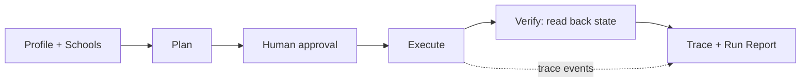

# TransferPilot

An AI agent that turns a college transfer applicant's profile and target schools into verified action across their own apps — gap analysis, essay critique, a deadline tracker, calendar reminders, and drafted outreach — gated behind human approval, with evals that prove it works.

| | |
|---|---|
| Live showcase (GitHub Pages) | https://wolfwdavid.github.io/multi-app-agent/ |
| Live demo (HF Space) | https://huggingface.co/spaces/WolfDavid/multi-app-agent |
| Live backend (Vercel) | <!-- TODO(phase 9): Vercel URL --> |
| System & reliability brief | [BRIEF.md](BRIEF.md) |

## What it does

- Per-school gap analysis: GPA vs. requirements, unit conversion, prereqs, essays/recs, and days to deadline — deterministic and sourced, not LLM-guessed
- Essay critique, not ghostwriting: questions and rubric comments scored against each school's transfer prompt, never rewritten prose
- Notion tracker row per school and Google Calendar deadline/reminder events, deduplicated on re-run
- Gmail outreach drafts only — there is no `send` method in the Gmail connector at all
- Portfolio evidence pulled from GitHub and Hugging Face (and optionally a local Obsidian vault) to strengthen essays and activities
- Human approval gate before every external write, with a dry-run preview of the full plan

## Why it's reliable

- Every plan is signed and requires explicit per-action approval before any write — see [BRIEF.md §2](BRIEF.md#2-architecture)
- Idempotency keys are checked via `findByKey` before every write and every retry, so re-runs and "ghost writes" produce zero duplicates — [BRIEF.md §3](BRIEF.md#3-reliability-measures-mapped-to-lemmas-failure-taxonomy)
- A verifier reads back each app's actual final state; the run report reflects reality, not the agent's self-report — [BRIEF.md §3](BRIEF.md#3-reliability-measures-mapped-to-lemmas-failure-taxonomy)
- Seeded fault injection (429, 500, ghost-write, lying-success, latency) exercises retries and silent-failure detection before it ever hits a real API — [BRIEF.md §3](BRIEF.md#3-reliability-measures-mapped-to-lemmas-failure-taxonomy)
- An eval harness runs an adversarial scenario suite N times against fresh mock worlds and reports pass rate and pass^k, graded by a state oracle independent of the agent's own report — [BRIEF.md §4](BRIEF.md#4-evaluation)

## Architecture

Workflow-first: the plan is fixed and signed before any untrusted content (a doc, an email) is read, so a prompt injection cannot add a write action.



Repo map:

```
web/src/lib/core/
  schemas/               zod domain contracts (school, profile, fixtures)
  connectors/
    mock/                stateful, credential-free app twins + fault injection
    real/                real connectors behind the same ports
  gap/                   deterministic gap analysis and feasibility warnings
  agent/                 planner, policy gate, executor, verifier
  llm/                   OpenAI-compatible LLM client (Ollama / hosted)
  trace/                 span tracer, PII redaction
  tools/                 typed tool registry shared by the agent, evals, and MCP
  eval/                  scenario suite, state oracle, Lemma taxonomy classifier
web/src/routes/          SvelteKit UI + REST API routes
web/scripts/             CLIs (sprint runner, eval runner, real-app smoke test, MCP server)
```

## Quick start

**Prerequisites:** Node 24, npm. Optional: [Ollama](https://ollama.com) running locally at `127.0.0.1:11434` with `qwen3.5:4b` and/or `qwen2.5-coder:7b` pulled, for the real-LLM path.

```bash
cd web
npm ci
npm test
npm run check
npm run dev
```

Environment setup:

```bash
cp web/.env.example web/.env
```

| Variable | Purpose |
|---|---|
| `MODE` | Run mode: `mock` (in-repo stateful app twins) or `real` (live connectors) |
| `LLM_BASE_URL` | OpenAI-compatible LLM endpoint (defaults to local Ollama) |
| `LLM_API_KEY` | API key for the OpenAI-compatible endpoint (blank for local Ollama) |
| `LLM_MODEL` | Model name to request from the LLM endpoint |
| `OLLAMA_URL` | Ollama's native API base URL, used for `think:false` requests |
| `NOTION_TOKEN` | Notion integration token for the tracker database |
| `NOTION_DATA_SOURCE_ID` | Notion data source id shared with the integration |
| `GOOGLE_CLIENT_ID` | Google OAuth client id (Desktop app type) |
| `GOOGLE_CLIENT_SECRET` | Google OAuth client secret |
| `GOOGLE_REFRESH_TOKEN` | Google OAuth refresh token for the demo user |
| `GOOGLE_CALENDAR_ID` | Calendar to write deadline events to |
| `GOOGLE_OAUTH_PORT` | Local loopback port for the one-time OAuth consent flow |
| `GITHUB_USERNAME` | GitHub username to pull public portfolio evidence from |
| `HF_USERNAME` | Hugging Face username to pull public portfolio evidence from |
| `GITHUB_TOKEN` | Optional GitHub token; raises the rate limit and enables language breakdown |
| `OBSIDIAN_VAULT_PATH` | Optional local Obsidian vault path for portfolio evidence |
| `PLAN_SIGNING_SECRET` | HMAC secret for signed plan approval tokens |

Additional commands as later phases land (run from `web/`):

```bash
npx tsx scripts/sprint.ts --profile demo --auto-approve --rerun   # or: npm run record   <!-- TODO(phase 4) -->
npx tsx scripts/eval.ts --n 10                                     <!-- TODO(phase 6) -->
npx tsx scripts/smoke-real.ts                                      <!-- TODO(phase 10) -->
npx tsx scripts/mcp.ts                                             <!-- TODO(phase 11) -->
```

## Connected apps

| App | What it does | Mock twin | Real connector |
|---|---|---|---|
| Notion | Writes one tracker row per school (deadline, docs, recs, status) | Built — upsert-by-key | <!-- TODO(phase 10) --> not configured |
| Google Calendar | Writes deadline + reminder events | Built — 409 on duplicate key | <!-- TODO(phase 10) --> not configured |
| Google Docs/Drive | Reads essay draft, writes critique doc | Built | <!-- TODO(phase 10) --> not configured |
| Gmail | Writes outreach drafts only (no `send`) | Built | <!-- TODO(phase 10) --> not configured |
| GitHub | Reads public repos as portfolio evidence | Built (fixture-seeded) | <!-- TODO(phase 10) --> public REST, planned |
| Hugging Face | Reads public models/Spaces as portfolio evidence | Built (fixture-seeded) | <!-- TODO(phase 10) --> public Hub API, planned |
| Obsidian | Reads vault notes as optional portfolio evidence | — | <!-- TODO(phase 10) --> planned, first cut candidate |

## 2-minute demo script

- **0:00–0:15** — The problem: transfer requirements, deadlines, and essay coaching are scattered across disconnected tools
- **0:15–0:45** — Load a student profile, see the per-school gap report with sourced requirements <!-- TODO(phase 7) -->
- **0:45–1:15** — Review the dry-run plan, approve it, watch the live step trace execute across apps <!-- TODO(phase 7) -->
- **1:15–1:40** — Re-run the sprint: every action shows `deduped`, zero new writes; replay a caught silent failure <!-- TODO(phase 7) -->
- **1:40–2:00** — Eval dashboard: pass rate and pass^k across scenarios, then a look at the real (non-mock) apps <!-- TODO(phase 7) -->

## Ethics & data

- Essay coaching is a critique, not a ghostwriter — output is questions and rubric comments, never rewritten prose, consistent with Common App's fraud policy on AI-generated content
- Gmail integration is drafts-only; no `send` method exists in the connector and the send OAuth scope is never requested — nothing sends or submits without a human doing it themselves
- Student data gets FERPA-grade handling: a single local profile, only the specified essay doc is read (never the whole Drive or inbox), and PII is redacted from exported traces
- Every requirement in the seed dataset carries a `source_url`, a `retrieved_at` date, and a `confidence` level, and the UI links to the official page so students can verify it

## Hackathon

Built for the [Multi-App AI Agent Hackathon](https://multiappagenthackathon.com/) (Sept 13, 2026).

## License

MIT
