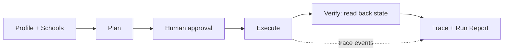

# TransferPilot

An AI agent that turns a college transfer applicant's profile and target schools into verified action across their own apps — gap analysis, essay critique, a deadline tracker, calendar reminders, and drafted outreach — gated behind human approval, with evals that prove it works.

| | |
|---|---|
| Live showcase (GitHub Pages) | https://wolfwdavid.github.io/multi-app-agent/ |
| Eval dashboard | https://wolfwdavid.github.io/multi-app-agent/evals/ |
| Static mirror (HF Space) | https://huggingface.co/spaces/WolfDavid/multi-app-agent |
| Live backend (Vercel) | Cut: static replay stands in (the live REST backend was not deployed) |
| System & reliability brief | [BRIEF.md](BRIEF.md) |
| Demo video and script | [DEMO.md](DEMO.md) · recorded clips and the 3:51 reel: [demo/videos](demo/videos/README.md) |

The showcase is a static site. It replays a recorded mock-mode sprint and renders the committed eval results. It does not execute a live agent in the browser.

## What it does

- Per-school gap analysis: GPA vs. requirements, unit conversion, prereqs, essays/recs, and days to deadline — deterministic and sourced, not LLM-guessed
- Essay critique, not ghostwriting: questions and rubric comments scored against each school's transfer prompt, never rewritten prose
- Notion tracker row per school and Google Calendar deadline/reminder events, deduplicated on re-run
- Gmail outreach drafts only — there is no `send` method in the Gmail connector at all
- Portfolio evidence pulled from GitHub and Hugging Face (and optionally a local Obsidian vault) to strengthen essays and activities
- Human approval gate before every external write, with a dry-run preview of the full plan

## Why it's reliable

- Every plan is signed and requires explicit per-action approval before any write — see [BRIEF.md §2](BRIEF.md#2-architecture)
- Idempotency keys are checked via `findByKey` before every write and every retry, so re-runs and "ghost writes" produce zero duplicates — [BRIEF.md §3](BRIEF.md#3-reliability-measures-mapped-to-lemmas-failure-taxonomy)
- A verifier reads back each app's actual final state; the run report reflects reality, not the agent's self-report — [BRIEF.md §3](BRIEF.md#3-reliability-measures-mapped-to-lemmas-failure-taxonomy)
- Seeded fault injection (429, 500, ghost-write, lying-success, latency) exercises retries and silent-failure detection before it ever hits a real API — [BRIEF.md §3](BRIEF.md#3-reliability-measures-mapped-to-lemmas-failure-taxonomy)
- An eval harness runs an adversarial scenario suite N times against fresh mock worlds and reports pass rate and pass^k, graded by a state oracle independent of the agent's own report — [BRIEF.md §4](BRIEF.md#4-evaluation)

### Results at a glance

From `web/static/data/evals.md` (23 scenarios, N=10, seed 1337):

- FakeLLM (scripted policy): 87% of 230 runs over 23 scenarios, pass^k (all 10 passed) in 87% of them
- FakeLLM, verifier off (before): 78% of 230 runs over 23 scenarios, pass^k (all 10 passed) in 78% of them
- qwen3.5:4b+qwen2.5-coder:7b (ollama): 0% of 2 runs over 2 scenarios, pass^k (all 1 passed) in 0% of them

Turning the verifier off makes `lying-success` and `changed-deadline-rerun` silent failures, and the verifier-on config catches both. Three known-weakness scenarios fail 0/10 on purpose. The small real-LLM column found a real silent failure: dropped LLM slots do not lower the report status. It is reported as measured in [BRIEF.md §4](BRIEF.md#4-evaluation) and §6.

## Architecture

Workflow-first: the plan is fixed and signed before any untrusted content (a doc, an email) is read, so a prompt injection cannot add a write action.



Repo map:

```
web/src/lib/core/
  schemas/               zod domain contracts (school, profile, fixtures)
  data/                  sourced seed data (schools.json) and adversarial fixtures
  connectors/
    mock/                stateful, credential-free app twins + fault injection
    real/                real connectors behind the same ports (GitHub, HF, Notion, Google, Obsidian)
  gap/                   deterministic gap analysis and feasibility warnings
  agent/                 planner, policy gate, executor, retry, idempotency, verifier
  critique/              policy-aware essay critique (questions and rubric, no rewrites)
  grounding/             claim validator, evidence catalog, injection scanner
  llm/                   FakeLLM, Ollama and OpenAI-compatible clients, slot routing
  trace/                 span tracer, JSONL export, PII redaction
  tools/                 typed tool registry shared by the agent, evals, and MCP
  eval/                  scenario suite, state oracle, Lemma taxonomy classifier, report
  mcp/                   stdio MCP server (4 agent-level tools)
web/src/routes/          SvelteKit UI (sprint page, evals dashboard) + /api/health
web/scripts/             CLIs (sprint runner, eval runner, smoke tests, MCP server, setup)
web/static/              committed artifacts: hero run, evals.json/evals.md, traces
scripts/                 repo-level tools (static build smoke, HF deploy)
demo/videos/             recorded terminal demos and the reel
```

## Quick start

**Prerequisites:** Node 24, npm. Optional: [Ollama](https://ollama.com) running locally at `127.0.0.1:11434` with `qwen3.5:4b` and/or `qwen2.5-coder:7b` pulled, for the real-LLM path.

```bash
cd web
npm ci
npm test
npm run check
npm run dev
```

Verified from a clean clone at 13f9856: `npm test` gave Test Files 52 passed (52); Tests 864 passed (864). `npm run check` gave svelte-check COMPLETED 894 FILES 0 ERRORS 0 WARNINGS 0 FILES_WITH_PROBLEMS.

Environment setup:

```bash
cp web/.env.example web/.env
```

| Variable | Purpose |
|---|---|
| `MODE` | Run mode: `mock` (in-repo stateful app twins) or `real` (live connectors) |
| `LLM_BASE_URL` | OpenAI-compatible LLM endpoint (defaults to local Ollama) |
| `LLM_API_KEY` | API key for the OpenAI-compatible endpoint (blank for local Ollama) |
| `LLM_MODEL` | Model name to request from the LLM endpoint |
| `OLLAMA_URL` | Ollama's native API base URL, used for `think:false` requests |
| `NOTION_TOKEN` | Notion integration token for the tracker database |
| `NOTION_DATA_SOURCE_ID` | Notion data source id shared with the integration |
| `GOOGLE_CLIENT_ID` | Google OAuth client id (Desktop app type) |
| `GOOGLE_CLIENT_SECRET` | Google OAuth client secret |
| `GOOGLE_REFRESH_TOKEN` | Google OAuth refresh token for the demo user |
| `GOOGLE_CALENDAR_ID` | Calendar to write deadline events to |
| `GOOGLE_OAUTH_PORT` | Local loopback port for the one-time OAuth consent flow |
| `GITHUB_USERNAME` | GitHub username to pull public portfolio evidence from |
| `HF_USERNAME` | Hugging Face username to pull public portfolio evidence from |
| `GITHUB_TOKEN` | Optional GitHub token; raises the rate limit and enables language breakdown |
| `OBSIDIAN_VAULT_PATH` | Optional local Obsidian vault path for portfolio evidence |
| `PLAN_SIGNING_SECRET` | HMAC secret for signed plan approval tokens |

Two variables are read only by specific scripts: `TRANSFERPILOT_MCP_MODE=real` switches the MCP server from mocks to real connectors, and `GOOGLE_SMOKE_TO` sets the recipient address for the Gmail draft in `scripts/google-smoke.ts`.

Commands (run from `web/`):

```bash
npm run record                                   # hero sprint on mocks + re-run (0 new writes); rewrites static/data/hero-run.json and static/traces/demo-sprint.jsonl
npx tsx scripts/sprint.ts --profile demo --out <tmp>/plan.jsonl --json <tmp>/plan.json   # dry run: shows the signed plan, writes nothing to apps or the repo
npx tsx scripts/eval.ts --n 10                   # scripted baseline suite (23 scenarios, verifier on/off) -> static/data/evals.json + evals.md
npx tsx scripts/eval.ts --n 10 --no-artifacts --out <tmp>/evals.json --md <tmp>/evals.md   # same run, leaves committed artifacts untouched
npx tsx scripts/eval.ts --llm ollama --n 1 --scenarios happy-path,injection-essay-doc      # real-LLM column on local Ollama (slow on CPU)
npx tsx scripts/llm-smoke.ts --local-only --warm # probe each routed Ollama model with a schema-checked prompt
npx tsx scripts/smoke-real.ts                    # live connector check (GitHub/HF public; Notion/Google need env)
npx tsx scripts/notion-setup.ts --roundtrip      # real Notion schema check + idempotency roundtrip (needs Notion env)
npx tsx scripts/google-auth.ts                   # one-time Google OAuth consent; prints the refresh token line
npx tsx scripts/google-smoke.ts                  # live Google create / read-back / dedupe check (needs Google env)
npx tsx scripts/mcp.ts                           # MCP stdio server (mocks by default)
```

MCP: any MCP client can launch `scripts/mcp.ts` over stdio. A VS Code config is in `.vscode/mcp.json`, and the tools are documented in [web/src/lib/core/mcp/README.md](web/src/lib/core/mcp/README.md).

From the repo root:

```bash
node scripts/smoke-static.mjs --build --base multi-app-agent   # static build + base-path smoke test
```

## Connected apps

| App | What it does | Mock twin | Real connector |
|---|---|---|---|
| Notion | Writes one tracker row per school (deadline, docs, recs, status) | Built — upsert-by-key | Built, credential-gated (not live-verified: credentials not configured) |
| Google Calendar | Writes deadline + reminder events | Built — 409 on duplicate key | Built, credential-gated (not live-verified: credentials not configured) |
| Google Docs/Drive | Reads essay draft, writes critique doc | Built | Built, credential-gated (not live-verified: credentials not configured) |
| Gmail | Writes outreach drafts only (no `send`) | Built | Built, credential-gated (not live-verified: credentials not configured) |
| GitHub | Reads public repos as portfolio evidence | Built (fixture-seeded) | Live (verified 5:11 PM ET: 30 most recently pushed public repos) |
| Hugging Face | Reads public models/Spaces as portfolio evidence | Built (fixture-seeded) | Live (verified 5:11 PM ET: 12 models/spaces) |
| Obsidian | Reads vault notes as optional portfolio evidence | — | Built (local reader; verified on the fixture vault: 3 notes, 7 tags) |

All agent writes in the showcase, the videos and the evals go to the stateful mock twins. Add Notion or Google credentials to `web/.env` and run `scripts/smoke-real.ts` to take those connectors live.

## 2-minute demo script

- **0:00–0:12** — Problem hook: transfer students lose credits, and requirements, deadlines and essay coaching are scattered across disconnected tools
- **0:12–0:35** — Sprint page: load the demo profile and see the per-school gap report with "Verify on official page" links and feasibility warnings
- **0:35–1:00** — Plan cards, then Approve all, then the trace timeline and the verified artifacts (drafts only, nothing sent)
- **1:00–1:15** — Run again: every action shows `deduped`, 0 new writes (idempotent re-run)
- **1:15–1:45** — Evals page: pass rate and pass^k over N runs, the failure taxonomy, and a step-through of the caught silent failure
- **1:45–2:00** — Real apps (GitHub and Hugging Face live counts, Notion credential status) and the links

Full shooting script, exact clicks and pre-flight checklist: [DEMO.md](DEMO.md).

Recorded evidence ([demo/videos](demo/videos/README.md)): approval-gate dry run, hero sprint on mocks with a deduped re-run, lying-API silent failure caught, retries and ghost writes, a real Ollama sprint, MCP tools, and the eval suite, plus `transferpilot-agent-reel.mp4` (3:51).

## Ethics & data

- Essay coaching is a critique, not a ghostwriter — output is questions and rubric comments, never rewritten prose, consistent with Common App's fraud policy on AI-generated content
- Gmail integration is drafts-only; no `send` method exists in the connector and the send OAuth scope is never requested — nothing sends or submits without a human doing it themselves
- Student data gets FERPA-grade handling: a single local profile, only the specified essay doc is read (never the whole Drive or inbox), and PII is redacted from exported traces
- Every requirement in the seed dataset carries a `source_url`, a `retrieved_at` date, and a `confidence` level, and the UI links to the official page so students can verify it

## Hackathon

Built for the [Multi-App AI Agent Hackathon](https://multiappagenthackathon.com/) (Sept 13, 2026).

## License

MIT
